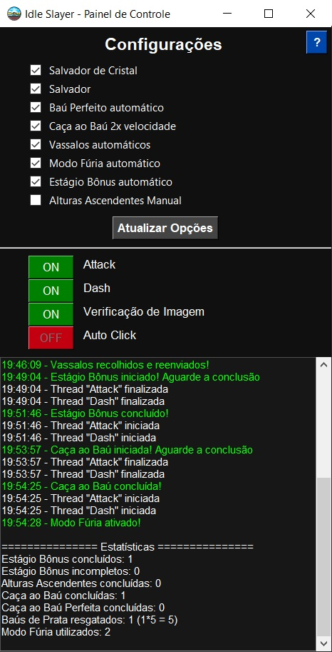

# Idle Slayer Bot
Este projeto é um software de automação para o jogo **Idle Slayer**, permitindo que determinadas ações sejam realizadas automaticamente para otimizar a jogabilidade.



## 🎮 Sobre o Idle Slayer
Este é um jogo incremental onde o jogador coleta moedas, derrota inimigos e melhora suas habilidades para evoluir.  
O jogo está disponível gratuitamente na Steam e pode ser baixado através do link abaixo:  
🔗 [Idle Slayer na Steam](https://store.steampowered.com/app/1353300/Idle_Slayer/)  

## ⚙️ Funcionalidades
- Automação do ataque e dash do personagem
- Busca e interação automática com elementos e minigames dentro do jogo (Modo Fúria, Vassalos, Baú de Prata, Caça ao Baú, Estágio Bonus e Alturas Ascendentes)
- Sistema de Auto Click prático e eficiente
- Configurações personalizáveis para ativar/desativar funções conforme sua necessidade, mantendo as preferências salvas de sua última execução

## 🚀 Como Usar
1. Clone este repositório:
  ```bash
  git clone https://github.com/GiovanniPretti/Idle-Slayer-Bot.git
  cd Idle-Slayer-Bot
  ```
2. Instale as dependências:
  ```bash
  pip install -r requirements.txt
  ```

- ### Opção 1: Executar com Python
  - Execute o script:
    ```bash
    python main.py
    ```

- ### Opção 2: Gerar um Executável
  - Instale o PyInstaller:
    ```bash
    pip install pyinstaller
    ```
  - Execute o arquivo "build.bat" diretamente ou via terminal. O executável será gerado automaticamente na pasta "dist" após a compilação.

## 📋 Requisitos do Software
- Idioma: Português-BR.
- Modo de Exibição: Modo Janela.
- Resolução: 1280x720.
- Atalho do Teclado "Pular": "W".
- Atalho do Teclado "Impulso": "D".

## 📦 Bibliotecas Utilizadas
os, sys, time, datetime, json, numpy, tkinter, pyautogui, pynput, threading, opencv-python e cv2.


📌 Se este projeto foi útil para você, considere dar uma ⭐ no repositório!